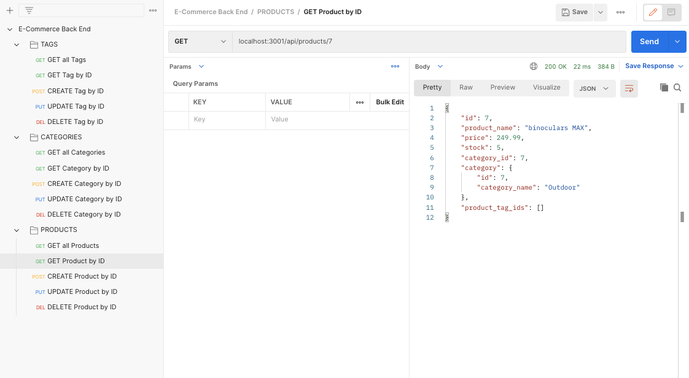

# e-commerce back end

## Description
- 

### The User Story for this project is as follows:
- AS A manager at an internet retail company, I WANT a back end for my e-commerce website that uses the latest technologies, SO THAT my company can compete with other e-commerce companies

### The codebase meets the following criteria for acceptance:
- WHEN I add my database name, MySQL username, and MySQL password to an environment variable file, THEN I am able to connect to a database using Sequelize
- WHEN I enter schema and seed commands, THEN a development database is created and is seeded with test data
- WHEN I enter the command to invoke the application, THEN my server is started and the Sequelize models are synced to the MySQL database
- WHEN I open API GET routes in Insomnia Core for categories, products, or tags, THEN the data for each of these routes is displayed in a formatted JSON
- WHEN I test API POST, PUT, and DELETE routes in Insomnia Core, THEN I am able to successfully create, update, and delete data in my database

### Installation
- The project is uploaded to [GitHub](https://github.com/) at the following repository: [here](https://github.com/sourslaw/e-commerce_back_end)

### Usage

### Credits
- 

### License
- Licensed under the [MIT](https://opensource.org/licenses/mit-license.php) license.